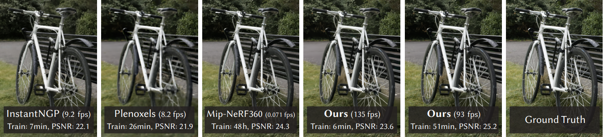

# 3D Gaussian Splatting for Real-Time Radiance Field Rendering

Bernhard Kerbl*, Georgios Kopanas*, Thomas Leimkühler, George Drettakis 
*(indicates equal contribution)*

[](https://repo-sam.inria.fr/fungraph/3d-gaussian-splatting/) [](https://repo-sam.inria.fr/fungraph/3d-gaussian-splatting/3d_gaussian_splatting_high.pdf) [](https://youtu.be/T_kXY43VZnk) [](http://www-sop.inria.fr/reves/publis/gdindex.php) [](https://fungraph.inria.fr)
[-0180A3)](https://repo-sam.inria.fr/fungraph/3d-gaussian-splatting/datasets/input/tandt_db.zip) [-0180A3)](https://repo-sam.inria.fr/fungraph/3d-gaussian-splatting/datasets/pretrained/models.zip) [-0180A3)](https://repo-sam.inria.fr/fungraph/3d-gaussian-splatting/binaries/viewers.zip) [-0180A3)](https://repo-sam.inria.fr/fungraph/3d-gaussian-splatting/evaluation/images.zip)



This repository contains the official authors implementation associated with the paper [3D Gaussian Splatting for Real-Time Radiance Field Rendering](https://repo-sam.inria.fr/fungraph/3d-gaussian-splatting/). We further provide the reference images used to create the error metrics reported in the paper, as well as recently created, pre-trained models. 

<a href="https://www.inria.fr/"></a><a href="https://univ-cotedazur.eu/"></a>
<a href="https://www.mpi-inf.mpg.de"></a><a href="https://team.inria.fr/graphdeco/"></a>

### ABSTRACT
> Radiance Field methods have recently revolutionized novel-view synthesis of scenes captured with multiple photos or videos. However, achieving high visual quality still requires neural networks that are costly to train and render, while recent faster methods inevitably trade off speed for quality. For unbounded and complete scenes (rather than isolated objects) and 1080p resolution rendering, no current method can achieve real-time display rates. We introduce three key elements that allow us to achieve state-of-the-art visual quality while maintaining competitive training times and importantly allow high-quality real-time (≥ 30 fps) novel-view synthesis at 1080p resolution. First, starting from sparse points produced during camera calibration, we represent the scene with 3D Gaussians that preserve desirable properties of continuous volumetric radiance fields for scene optimization while avoiding unnecessary computation in empty space; Second, we perform interleaved optimization/density control of the 3D Gaussians, notably optimizing anisotropic covariance to achieve an accurate representation of the scene; Third, we develop a fast visibility-aware rendering algorithm that supports anisotropic splatting and both accelerates training and allows realtime rendering. We demonstrate state-of-the-art visual quality and real-time rendering on several established datasets.

<section class="section" id="BibTeX">
  <div class="container is-max-desktop content">
    <h2 class="title">BibTeX</h2>
    <pre><code>@Article{kerbl3Dgaussians,
      author       = {Kerbl, Bernhard and Kopanas, Georgios and Leimk{\"u}hler, Thomas and Drettakis, George},
      title        = {3D Gaussian Splatting for Real-Time Radiance Field Rendering},
      journal      = {ACM Transactions on Graphics},
      number       = {4},
      volume       = {42},
      month        = {July},
      year         = {2023},
      url          = {https://repo-sam.inria.fr/fungraph/3d-gaussian-splatting/}
}</code></pre>
  </div>
</section>


## Funding and Acknowledgments

This research was funded by the ERC Advanced grant FUNGRAPH No 788065. The authors are grateful to Adobe for generous donations, the OPAL infrastructure from Université Côte d’Azur and for the HPC resources from GENCI–IDRIS (Grant 2022-AD011013409). The authors thank the anonymous reviewers for their valuable feedback, P. Hedman and A. Tewari for proofreading earlier drafts also T. Müller, A. Yu and S. Fridovich-Keil for helping with the comparisons.

## NEW FEATURES !

We have limited resources for maintaining and updating the code. However, we have added a few new features since the original release that are inspired by some of the excellent work many other researchers have been doing on 3DGS. We will be adding other features within the ability of our resources.

**Update of October 2024**: We integrated [training speed acceleration](process-scenes.md#training-speed-acceleration) and made it compatible with [depth regularization](process-scenes.md#depth-regularization), [anti-aliasing](process-scenes.md#anti-aliasing) and [exposure compensation](process-scenes.md#exposure-compensation). We have enhanced the SIBR real time viewer by correcting bugs and adding features in the [Top View](process-scenes.md#sibr-top-view) that allows visualization of input and user cameras.

**Update of Spring 2024**:
Orange Labs has kindly added [OpenXR support](process-scenes.md#openxr-support) for VR viewing. 

## Step-by-step Tutorial

Jonathan Stephens made a fantastic [ step-by-step tutorial](https://www.youtube.com/watch?v=UXtuigy_wYc) for setting up Gaussian Splatting on your machine, along with instructions for creating usable datasets from videos. If the instructions below are too dry for you, go ahead and check it out.

## Colab

User [@camenduru](https://github.com/camenduru) was kind enough to provide a [Colab template](https://github.com/camenduru/gaussian-splatting-colab) that uses this repo's source (status: August 2023!) for quick and easy access to the method. Please check it out.

## Cloning the Repository

The repository contains submodules, thus please check it out with 
```shell
# SSH
git clone git@github.com:ubi-coro/gaussian-splatting.git --recursive
```

## Overview

The codebase has 4 main components:

|  |  |
| :-- | :-- |
| [**1**](docs/process-scenes.md) | A script to help you turn your own images into optimization-ready SfM data sets |
| [**2**](docs/optimizer.md) | A PyTorch-based optimizer to produce a 3D Gaussian model from SfM inputs |
| [**3**](docs/viewers.md) | A network viewer that allows to connect to and visualize the optimization process<br>An OpenGL-based real-time viewer to render trained models in real-time |
| [**4**](docs/faq.md) | FAQ |

> [!NOTE]
> The components have different requirements w.r.t. both hardware and software. They have been tested on Windows 10 and Ubuntu Linux 22.04. Instructions for setting up and running each of them are found in the sections below.

