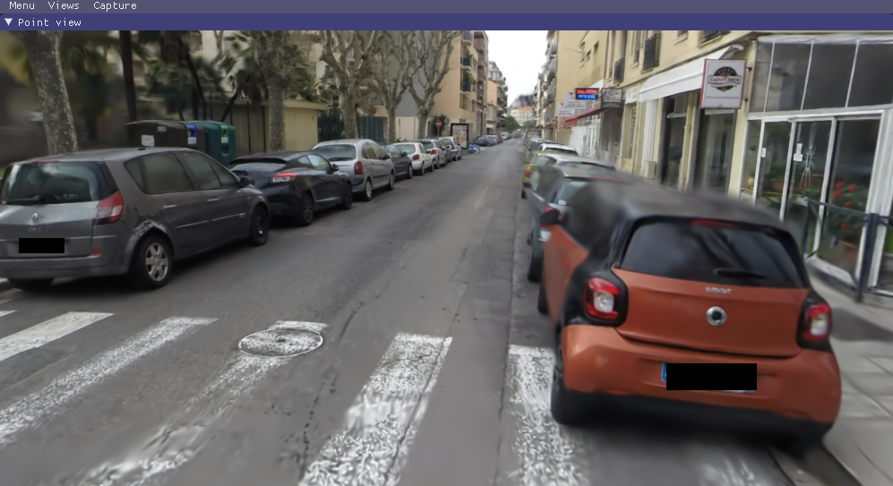

# FAQ

### Where do I get data sets, e. g., those referenced in ```full_eval.py```?

The MipNeRF360 data set is provided by the authors of the original paper on the project site. Note that two of the data sets cannot be openly shared and require you to consult the authors directly. For Tanks&Temples and Deep Blending, please use the download links provided at the top of the page. Alternatively, you may access the cloned data (status: August 2023!) from [HuggingFace](https://huggingface.co/camenduru/gaussian-splatting)


### How can I use this for a much larger dataset, like a city district?

The current method was not designed for these, but given enough memory, it should work out. However, the approach can struggle in multi-scale detail scenes (extreme close-ups, mixed with far-away shots). This is usually the case in, e.g., driving data sets (cars close up, buildings far away). For such scenes, you can lower the ```--position_lr_init```, ```--position_lr_final``` and ```--scaling_lr``` (x0.3, x0.1, ...). The more extensive the scene, the lower these values should be. Below, we use default learning rates (left) and ```--position_lr_init 0.000016 --scaling_lr 0.001"``` (right).

|  <!-- --> | <!-- -->  |
| --- | --- |

### I'm on Windows and I can't manage to build the submodules, what do I do?

Consider following the steps in the excellent video tutorial [here](https://www.youtube.com/watch?v=UXtuigy_wYc), hopefully they should help. The order in which the steps are done is important! Alternatively, consider using the linked Colab template.

### It still doesn't work. It says something about ```cl.exe```. What do I do?

User Henry Pearce found a workaround. You can you try adding the visual studio path to your environment variables (your version number might differ);
```C:\Program Files (x86)\Microsoft Visual Studio\2019\Community\VC\Tools\MSVC\14.29.30133\bin\Hostx64\x64```
Then make sure you start a new conda prompt and cd to your repo location and try this;
```
conda activate gaussian_splatting
cd <dir_to_repo>/gaussian-splatting
pip install submodules\diff-gaussian-rasterization
pip install submodules\simple-knn
```

### I'm on macOS/Puppy Linux/Greenhat and I can't manage to build, what do I do?

Sorry, we can't provide support for platforms outside of the ones we list in this README. Consider using the linked Colab template.

### I don't have 24 GB of VRAM for training, what do I do?

The VRAM consumption is determined by the number of points that are being optimized, which increases over time. If you only want to train to 7k iterations, you will need significantly less. To do the full training routine and avoid running out of memory, you can increase the ```--densify_grad_threshold```, ```--densification_interval``` or reduce the value of ```--densify_until_iter```. Note however that this will affect the quality of the result. Also try setting ```--test_iterations``` to ```-1``` to avoid memory spikes during testing. If ```--densify_grad_threshold``` is very high, no densification should occur and training should complete if the scene itself loads successfully.

### 24 GB of VRAM for reference quality training is still a lot! Can't we do it with less?

Yes, most likely. By our calculations it should be possible with **way** less memory (~8GB). If we can find the time we will try to achieve this. If some PyTorch veteran out there wants to tackle this, we look forward to your pull request!


### How can I use the differentiable Gaussian rasterizer for my own project?

Easy, it is included in this repo as a submodule ```diff-gaussian-rasterization```. Feel free to check out and install the package. It's not really documented, but using it from the Python side is very straightforward (cf. ```gaussian_renderer/__init__.py```).

### Wait, but ```<insert feature>``` isn't optimized and could be much better?

There are several parts we didn't even have time to think about improving (yet). The performance you get with this prototype is probably a rather slow baseline for what is physically possible.

### Something is broken, how did this happen?

We tried hard to provide a solid and comprehensible basis to make use of the paper's method. We have refactored the code quite a bit, but we have limited capacity to test all possible usage scenarios. Thus, if part of the website, the code or the performance is lacking, please create an issue. If we find the time, we will do our best to address it.
