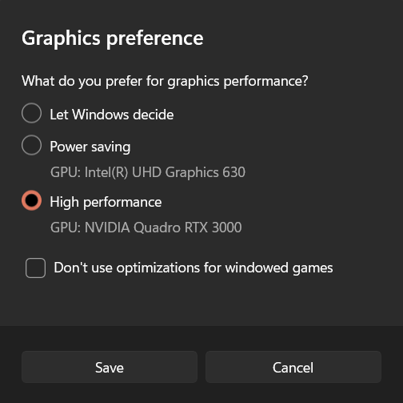

# Interactive Viewers

We provide two interactive viewers for our method: remote and real-time. Our viewing solutions are based on the [SIBR](https://sibr.gitlabpages.inria.fr/) framework, developed by the GRAPHDECO group for several novel-view synthesis projects.

| **Hardware Requirements** | **Software Requirements** |
| :-- | :-- |
| <ul><li>OpenGL 4.5-ready GPU and drivers (or latest MESA software)</li><li>4 GB VRAM recommended</li><li>CUDA-ready GPU with Compute Capability 7.0+ (only for Real-Time Viewer)</li></ul> | <ul><li>Visual Studio or g++, **not Clang** (we used Visual Studio 2019 for Windows)</li><li>CUDA SDK 11, install *after* Visual Studio (we used 11.8)</li><li>CMake (recent version, we used 3.24)</li><li>7zip (only on Windows)</li></ul> |

### Pre-built Windows Binaries

We provide pre-built binaries for Windows [here](https://repo-sam.inria.fr/fungraph/3d-gaussian-splatting/binaries/viewers.zip). We recommend using them on Windows for an efficient setup, since the building of SIBR involves several external dependencies that must be downloaded and compiled on-the-fly.

### Installation from Source

If you cloned with submodules (e.g., using ```--recursive```), the source code for the viewers is found in ```SIBR_viewers```. The network viewer runs within the SIBR framework for Image-based Rendering applications.

####  Windows

CMake should take care of your dependencies.
```shell
cd SIBR_viewers
cmake -Bbuild .
cmake --build build --target install --config RelWithDebInfo
```
You may specify a different configuration, e.g. ```Debug``` if you need more control during development.

####  Ubuntu 22.04

You will need to install a few dependencies before running the project setup.

```shell
# Dependencies
sudo apt install -y libglew-dev libassimp-dev libboost-all-dev libgtk-3-dev libopencv-dev libglfw3-dev libavdevice-dev libavcodec-dev libeigen3-dev libxxf86vm-dev libembree-dev
# Project setup
cd SIBR_viewers
cmake -Bbuild . -DCMAKE_BUILD_TYPE=Release # add -G Ninja to build faster
cmake --build build -j24 --target install
``` 

####  Ubuntu 20.04

Backwards compatibility with Focal Fossa is not fully tested, but building SIBR with CMake should still work after invoking.

```shell
git checkout fossa_compatibility
```

### Navigation in SIBR Viewers

The SIBR interface provides several methods of navigating the scene. By default, you will be started with an FPS navigator, which you can control with ```W, A, S, D, Q, E``` for camera translation and ```I, K, J, L, U, O``` for rotation. Alternatively, you may want to use a Trackball-style navigator (select from the floating menu). You can also snap to a camera from the data set with the ```Snap to``` button or find the closest camera with ```Snap to closest```. The floating menues also allow you to change the navigation speed. You can use the ```Scaling Modifier``` to control the size of the displayed Gaussians, or show the initial point cloud.

### Running the Network Viewer

https://github.com/graphdeco-inria/gaussian-splatting/assets/40643808/90a2e4d3-cf2e-4633-b35f-bfe284e28ff7

After extracting or installing the viewers, you may run the compiled ```SIBR_remoteGaussian_app[_config]``` app in ```<SIBR install dir>/bin```, e. g.:

```shell
./<SIBR install dir>/bin/SIBR_remoteGaussian_app
```

The network viewer allows you to connect to a running training process on the same or a different machine. If you are training on the same machine and OS, no command line parameters should be required: the optimizer communicates the location of the training data to the network viewer. By default, optimizer and network viewer will try to establish a connection on **localhost** on port **6009**. You can change this behavior by providing matching ```--ip``` and ```--port``` parameters to both the optimizer and the network viewer. If for some reason the path used by the optimizer to find the training data is not reachable by the network viewer (e.g., due to them running on different (virtual) machines), you may specify an override location to the viewer by using ```-s <source path>```. 

<details>
<summary><span style="font-weight: bold;">Primary Command Line Arguments for Network Viewer</span></summary>

  |  |  |
  | :-- | :-- |
  | **--path**<br>**-s** | Argument to override model's path to source dataset. |
  | **--ip** | IP to use for connection to a running training script. |
  | **--port** | Port to use for connection to a running training script. |
  | **--rendering-size** | Takes two space separated numbers to define the resolution at which network rendering occurs, ```1200``` width by default.<br>Note that to enforce an aspect that differs from the input images, you need ```--force-aspect-ratio``` too. |
  | **--load_images** | Flag to load source dataset images to be displayed in the top view for each camera. |
</details>
<br>

### Running the Real-Time Viewer

https://github.com/graphdeco-inria/gaussian-splatting/assets/40643808/0940547f-1d82-4c2f-a616-44eabbf0f816

After extracting or installing the viewers, you may run the compiled ```SIBR_gaussianViewer_app[_config]``` app in ```<SIBR install dir>/bin```, e. g.:

```shell
./<SIBR install dir>/bin/SIBR_gaussianViewer_app -m <path to trained model>
```

It should suffice to provide the ```-m``` parameter pointing to a trained model directory. Alternatively, you can specify an override location for training input data using ```-s```. To use a specific resolution other than the auto-chosen one, specify ```--rendering-size <width> <height>```. Combine it with ```--force-aspect-ratio``` if you want the exact resolution and don't mind image distortion. 

> [!TIP]
> To unlock the full frame rate, please disable V-Sync on your machine and also in the application (Menu &rarr; Display). In a multi-GPU system (e. g., laptop) your OpenGL/Display GPU should be the same as your CUDA GPU (e. g., by setting the application's GPU preference on Windows, see below) for maximum performance.
>
> 

In addition to the initial point cloud and the splats, you also have the option to visualize the Gaussians by rendering them as ellipsoids from the floating menu.
SIBR has many other functionalities, please see the [documentation](https://sibr.gitlabpages.inria.fr/) for more details on the viewer, navigation options etc. There is also a Top View (available from the menu) that shows the placement of the input cameras and the original SfM point cloud; please note that Top View slows rendering when enabled. The real-time viewer also uses slightly more aggressive, fast culling, which can be toggled in the floating menu. If you ever encounter an issue that can be solved by turning fast culling off, please let us know.

<details>
<summary><span style="font-weight: bold;">Primary Command Line Arguments for Real-Time Viewer</span></summary>

  |  |  |
  | :-- | :-- |
  | **--model-path**<br>**-m** | Path to trained model. |
  | **--iteration** | Specifies which of state to load if multiple are available. Defaults to latest available iteration. |
  | **--path**<br>**-s** | Argument to override model's path to source dataset. |
  | **--rendering-size** | Takes two space separated numbers to define the resolution at which real-time rendering occurs, ```1200``` width by default. Note that to enforce an aspect that differs from the input images, you need ```--force-aspect-ratio``` too. |
  | **--load_images** | Flag to load source dataset images to be displayed in the top view for each camera. |
  | **--device** | Index of CUDA device to use for rasterization if multiple are available, ```0``` by default. |
  | **--no_interop** | Disables CUDA/GL interop forcibly. Use on systems that may not behave according to spec (e. g., WSL2 with MESA GL 4.5 software rendering). |
</details>
<br>